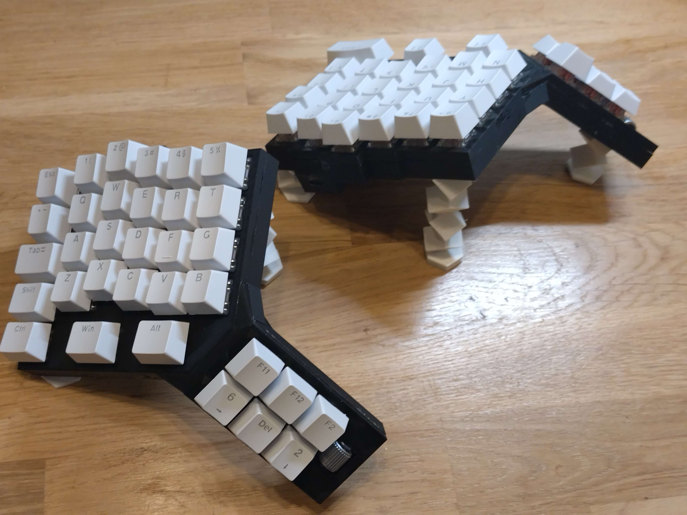

# Maker files

This repository contains STL files and project details for various 3D printing projects. Below are the available projects with a preview of the final results.

## Projects

### Custom Split Keyboard
Two versions of a custom split keyboard.

#### Version 1

For more details on Version 1, please visit the [Keyboard V1](keyboard/v1) folder.

#### Version 2 (WIP)

For more details on Version 2, please visit the [Keyboard V2](keyboard/v2) folder.

### Phone Holder
A custom-designed phone holder optimized for 3D printing.

For more details, please visit the [Phone Holder](phone_holder) folder.