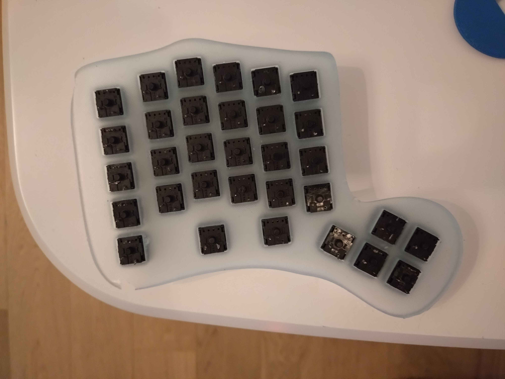
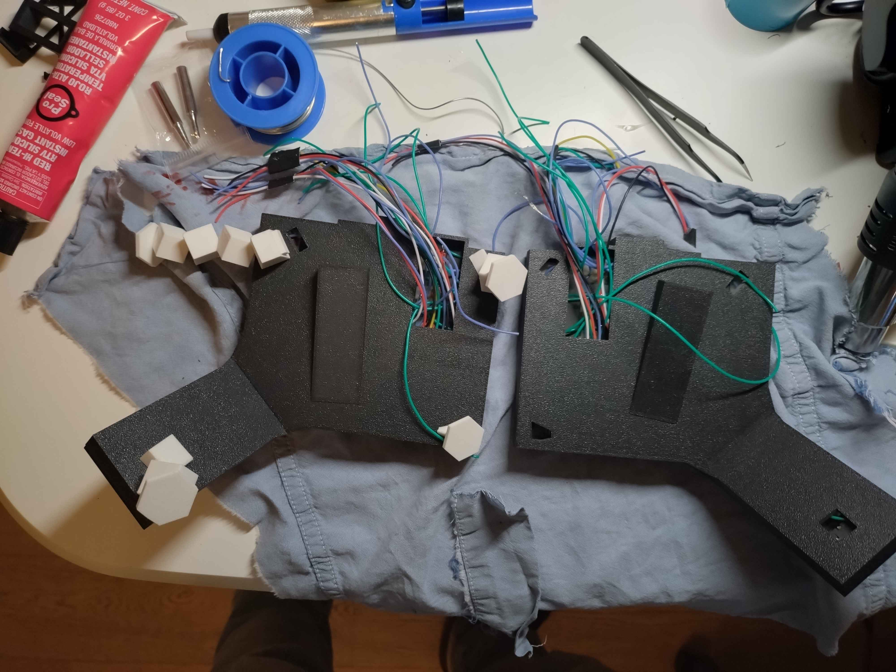

# Custom Split Keyboard

The keyboards has been designed in Fusion 360.
The V1 was 3D printed in basic PLA on a Bambu X1C with a 0.40 nozzle.
The V2 was 3D printed in basic PLA on a Bambu X1C with a 0.20 nozzle.

## Version 1

### Design Overview

### Epoxy Cast

### 3D Printed Version

## Version 2

### Design Overview

### Switch Placement

### Wiring

### Pre-Assembly

### Full Assembly

### Assembly with Default Keycaps

### Custom Keycaps Test

### Additional Notes
- The v2 design is not entirely finished as it still requires cleaning and painting.
- A full layout of custom keycaps is planned.
